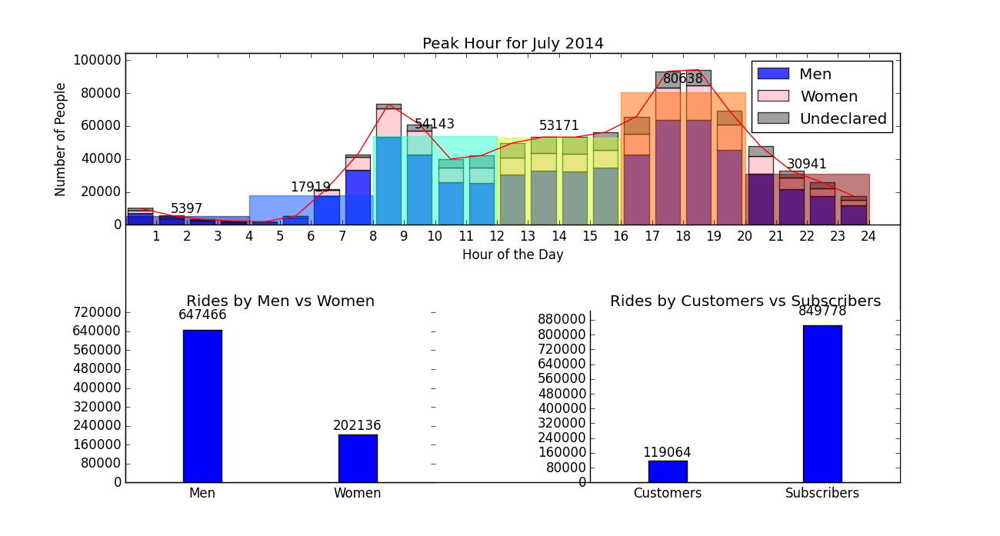

Clarity:
The plot is a little complicated and not so easy to read. The bar for each hour of the day is clear enough to understand, but the extra wider bar (for every 4 hours) is a little confusing.

Esthetic:
The overall color usage is well chosen. Blue for men and pink for women is a reasonable and understandable choice. However, the color chosen for the bar for every 4 hours seems lack of consideration. Moreover, to view the whole graph as a whole, the bottom part gives much simpler histograms, which is a great contrast compared with the top part. Also, the y-axis whose numbers are increased by 80000 each marker seems strange.

Honesty:
This plot is honestly reproducing the data without any distortions.

Suggestion:
1.Taking more consideration on the color chosen for the bar for every 4 hours.
2.For the bottom part, the numbers should be increased by 100000 each marker.

