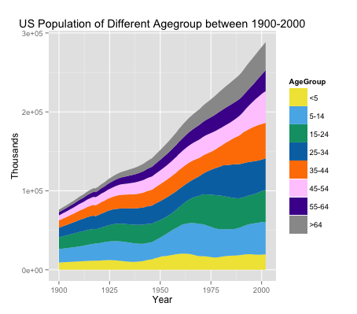

Clarity:
The graph is very easy to read as it directly shows the change of population of different ages in the United States. The quantities are visualized in a quite readable way.

Esthetic:
The chosen of color is appropriate as there are apparent differences between adjacent color bars. We may focus on every color of age group that we would prefer to focus on. The markers on the y-axis is not proper as it applies thousands as units. Numbers like 0e+00, 1e+05 are not so ‘beautiful’ though.

Honesty:
This plot is honestly reproducing the data without any distortions. Maybe people may concentrate on one age group due to their preference of colors, but that should not be a big issue.

Suggestion:
1.Change the unit of y-axis to ‘millions’.
2.Considerations of the usage of ‘Agegroup’, ‘AgeGroup’ or ‘Age Group’.
